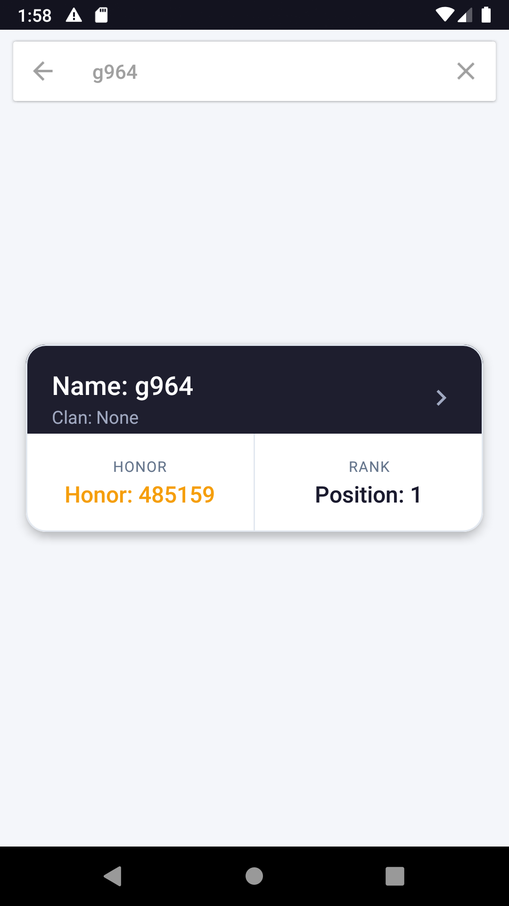
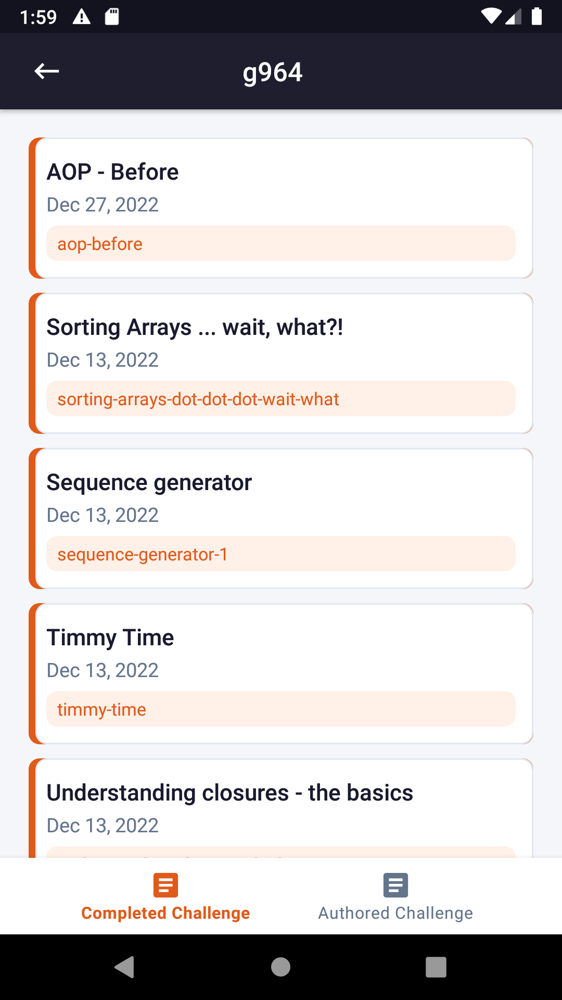
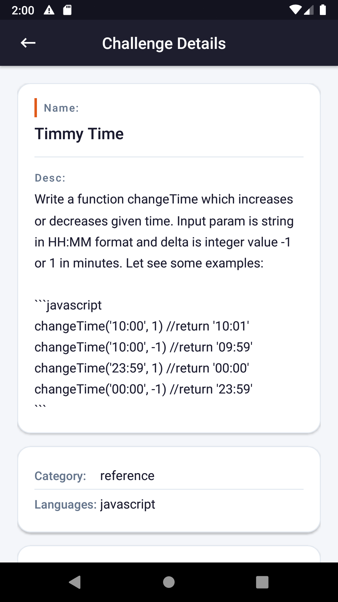

# Scalable Android App (MVVM + Clean Architecture + Paging 3)

A production-oriented Android application built using Clean Architecture and MVVM, designed to handle real-world scenarios such as paginated data loading, offline caching, and efficient UI updates.

This project demonstrates scalable architecture patterns used in modern Android applications.

---

## 🚀 Demo

### Screenshots

|                 Search User                 |                  User Details                 |                    Challenge Details                    |
| :-----------------------------------------: | :-------------------------------------------: | :-----------------------------------------------------: |
|  |  |  |


---

## ✨ Features

* **Search User** — Search any Codewars username and view their profile
* **Completed Challenges** — Browse paginated list of completed kata
* **Authored Challenges** — Browse paginated list of authored kata
* **Challenge Details** — View full kata description, tags, and ranking info
* **Offline Support** — Room database caches data for offline access
* **Pagination** — Paging 3 with network + local data via RemoteMediator

---

## ⚡ Highlights

* Efficient handling of large datasets using Paging 3 + RemoteMediator
* Offline-first approach with Room caching
* Reactive UI updates using Kotlin Flow
* Designed for scalability and smooth user experience

---

## 🧠 Architecture

The project follows **Clean Architecture** with three distinct layers:

presentation/   →   domain/   →   data/

| Layer          | Responsibilities                                       |
| -------------- | ------------------------------------------------------ |
| `presentation` | Activities, Fragments, ViewModels, UI adapters         |
| `domain`       | Use cases, repository interfaces, domain models        |
| `data`         | Repository implementations, Room DB, Retrofit, mappers |

This architecture ensures separation of concerns, testability, and scalability for production-level applications.

---

## ⚙️ Key Engineering Decisions

* Used Paging 3 with RemoteMediator to combine network + local data sources
* Implemented Flow for reactive and lifecycle-aware data streams
* Applied Clean Architecture to separate UI, business logic, and data layers
* Used Room for offline caching and improved performance

---

## 🌍 Real-World Use Case

This architecture is commonly used in production apps that require efficient data loading, offline support, and scalable UI updates.

---

## 🛠 Tech Stack

| Category     | Library                             |
| ------------ | ----------------------------------- |
| Architecture | MVVM + Clean Architecture           |
| DI           | Dagger Hilt 2.59                    |
| Async        | Kotlin Coroutines + Flow            |
| Networking   | Retrofit + OkHttp                   |
| JSON Parsing | Moshi                               |
| Local DB     | Room                                |
| Pagination   | Paging 3                            |
| Navigation   | AndroidX Navigation                 |
| UI           | Material Design 3, ConstraintLayout |
| Testing      | JUnit, MockK, Espresso              |

---

## 📱 Screens

### 1. Search User

Enter a Codewars username to look up their profile. Results are cached locally with Room.

### 2. User Details

Displays the user's **Completed** and **Authored** kata in two tabs with infinite scroll via Paging 3.

### 3. Challenge Details

Full kata view showing description, tags, total completions, and rank information.

---

## 🚀 Getting Started

1. Clone the repository

   ```bash
   git clone https://github.com/farazahmed66/scalable-android-mvvm-app.git
   ```
2. Open in **Android Studio**
3. Build and run on a device or emulator (API 21+)

> No API key required — uses the public Codewars API.

---

## 📂 Project Structure

```
com.faraz.codewars/
├── data/
│   ├── local/          # Room DAOs and Entities
│   ├── remote/         # Retrofit service and DTOs
│   ├── mapper/         # Data ↔ Domain mappers
│   ├── mediator/       # RemoteMediator (Paging 3)
│   └── repository/     # Repository implementations
├── domain/
│   ├── model/          # Domain models
│   ├── repository/     # Repository interfaces
│   └── usecase/        # Business logic use cases
├── presentation/
│   └── ui/
│       ├── users/              # Search & user list screen
│       ├── userdetails/        # Tabbed user detail screen
│       └── challengedetails/   # Kata detail screen
└── di/                 # Hilt modules
```


---

## 📌 Summary

This project showcases how to build scalable Android applications using modern architecture patterns, focusing on performance, maintainability, and real-world usability.
